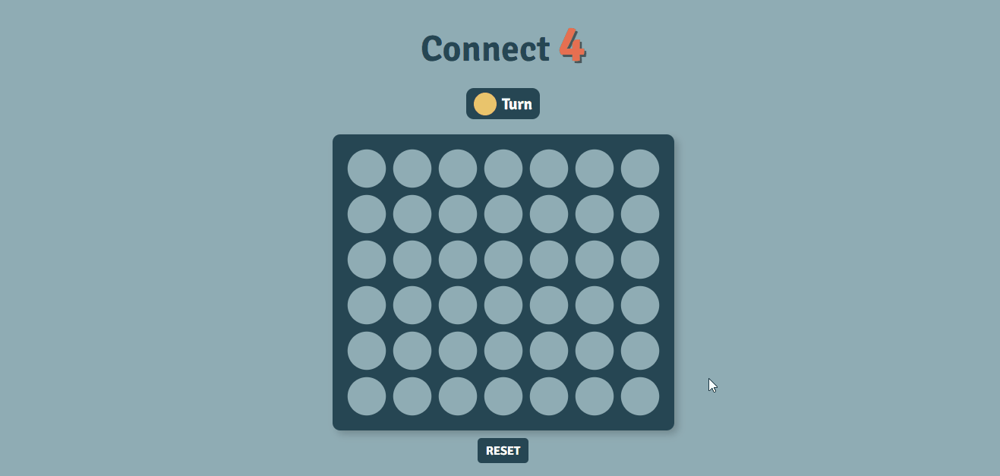

# Projeto Connect 4

## Demonstração

## Como jogar

Connect 4 é um jogo para dois jogadores, onde há uma grade com sete colunas e seis fileiras. O seu objetivo é conectar (seja na horizontal, na verical ou na diagonal) quatro peças da sua cor.
